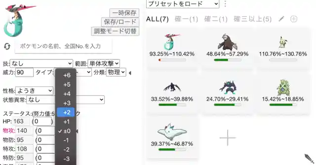
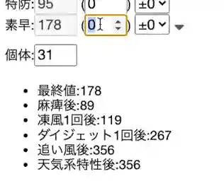
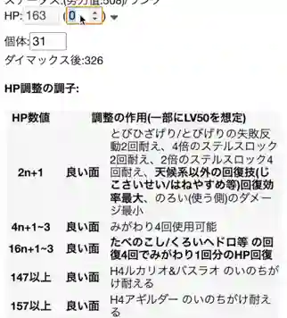

# 次世代Pokemon傷害計算器 for 劍盾
有別於傳統單對單計算器，本計算器為無限單對多計算，另附有HP、速度調整功能，適合VGC使用。(曾稱「X世代Pokemon傷害計算器」)

WebApp版:  
[https://pokemoncalc.web.app/](https://pokemoncalc.web.app/ja/) ([日文語](https://pokemoncalc.web.app/ja/)、[香港中文](https://pokemoncalc.web.app/hk/)、[English](https://pokemoncalc.web.app/en/))  
[<del>https://catho7.github.io/PokemonCalc/</del>](https://catho7.github.io/PokemonCalc/) (舊版，不再更新)

Desktop App版:  
[macOS](https://github.com/catho7/PokemonCalc/releases/download/0.0.2/NextGen.Calculator-darwin-x64.zip) ([M1](https://github.com/catho7/PokemonCalc/releases/download/0.0.2/NextGen.Calculator-darwin-arm64.zip))、[Window 64-bit](https://github.com/catho7/PokemonCalc/releases/download/0.0.2/NextGen.Calculator-win32-x64.zip) ([32-bit](https://github.com/catho7/PokemonCalc/releases/download/0.0.2/NextGen.Calculator-win32-ia32.zip) / [Arm](https://github.com/catho7/PokemonCalc/releases/download/0.0.2/NextGen.Calculator-win32-arm64.zip))、[Linux](https://github.com/catho7/PokemonCalc/releases/download/0.0.2/NextGen.Calculator-linux-x64.zip)  

Desktop版較少更新，其資料設定會保存在本機，且獨立於瀏覽器的設定

## Screenshot

Multi Pokemon Calculating on same time:  

Speed Fine-tuning:  

HP Fine-tuning:  

## 主要功能
* 攻擊測試：**一對多傷害計算**
	* 設快速轉換怪物功能 (「一時保存」以開啟)
	* 設快速轉換招式功能 (「**招式欄旁的箭咀**」以開啟)
* 防御測試：**多對一傷害計算** (「調整モード切替」以切換)
* **HP調整功能** (「HP欄旁的箭咀」以開啟)
* **速度調整功能** (「速度欄旁的箭咀」以開啟)
* 保存功能
* PWA功能，**安裝後能像一般App離線使用**，安裝方法：
	* iOS:「分享圖示->加入主畫面」(需開啟一次以載入資料方可離線使用)
	* Android:「網址列旁的圖示->安裝應用程式/新增至主螢幕」
	* 桌面Google Chrome:「更多圖示->更多工具->建立捷徑」，勾選「**在視窗中開啟**->建立」

安裝後可點擊底部的「オフライン用に画像保存(重い)」以下載離線用圖片。(總大小約6MB，請用WiFi或5G網絡下載，以免拖慢電話及網絡反應)

## 使用Tips
* 點擊**箭咀等圖示，可開啟更多功能**
* 點擊「編輯圖示」以開啟刪除功能，再**配合「一時保存」和招式切換等功能，能幫助組隊** (類似[Team Builder](https://marriland.com/tools/team-builder/)的作用)
* 真專用特性和專用道具僅限於該怪顯示
* 善用抓圖以保存結果
* 保存功能其資料只會保存在當前的機器及瀏覽器 (iOS上不使用兩星期會自動清空，此為iOS的機制)
* 調整的意義在於對戰時，你會知道發生什麼、不會發生什麼，並能從而判斷出對手的配置等
* 其他更深入的計算，請使用以下計算器：
	* [ポケモントレーナー天国](https://pokemon-trainer.net/swsh/damage/)
	* [ポケマス](https://pokemass.com/swsh/dc)
	* [Pokémon SoldieR](https://www.pokesol.com/tool/calc.html)

## 更新簡介

只列較重要部份

### 2022-02-02
解禁XY神獸特性

### 2022-01-28

加入香港中文和英文介面、安全性更新及修正一些問題

### 2022-01-05
修正圖鑑的搜尋結果顯示問題

### 2021-12-16

安全性更新、修正Android上無法安裝問題

### 2021-12-14
修正電話版上點擊後會放大的問題、更新圖示

網址轉為[https://PokemonCalc.web.app/](https://pokemoncalc.web.app/)，Github版不再更新

### 2021-12-10
新增Desktop版、<ins>新增圖示、大幅更新本說明文件</ins>、修正問題

Desktop版的設定會獨立保存，與瀏覽器的設定資料分開，且從頭到尾不連網都能夠完整使用。(WebApp版未下載過的圖片會無法顯示)

注意:Desktop版不會常時更新，且macOS版以外未確保能順利運行

### 2021-12-08
改善於較小螢幕的顯示、修正問題

### 舊更新簡介

[過去的更新簡介](CHANGELOG.md)

## 關於計算結果的準確性

遊戲的主要算式是已知的，因此所有計算器的結果都大同小異，問題在於細緻的部份，如：加乘位置、小數點處理位置、小數點處理方式等。

幸運的是，傷害計算有兩大計算器可作測試用參考，但事實上，兩大計算器亦有計算結果不同的時候，而本計算器基本上以「ポケモントレーナー天国」及「ポケマス」的結果為基準作測試。

絕望真相是，實機+實Game以外的程式都不會有100%準確的計算

實際上，包含環境在內的因素，即使由Game Freak利用遊戲代碼寫出計算器，亦不能保證結果100%跟遊戲一樣，所以任何計算器都只能當作參考。

## Bug Report / 回報或疑問
* [Github/PokemonCalc](https://github.com/catho7/PokemonCalc/issues/new) (中文、日文和英文也OK)

## Special Thanks to / 參考 / 資料來源
* [ポケモントレーナー天国 ダメージ計算機](https://pokemon-trainer.net/sm/dmcs/) - 測試對象/參考
* [ポケモントレーナー天国 ダメージ計算機 for ソード/シールド](https://pokemon-trainer.net/swsh/damage/) - 參考
* [ポケマス ダメージ計算ツール](https://pokemass.com/swsh/dc) - 測試對象
* [Pokémon Damage Calculator - smogon](https://calc.pokemonshowdown.com/) - 測試對象
* [ポケモンWiki](https://wiki.ポケモン.com/wiki/%E3%83%A1%E3%82%A4%E3%83%B3%E3%83%9A%E3%83%BC%E3%82%B8) - 資料/圖
* [ポケモン対戦考察まとめWiki](https://pokemon-wiki.net/) - 資料
* [Project’97](https://project1997.com) - 資料
* [ポケモン徹底攻略](https://yakkun.com/swsh/) - 資料
* [serebii.net](https://www.serebii.net/) - 圖
* [Pokémon Database](https://pokemondb.net/) - 資料
* [ポケモン剣盾(ソードシールド)攻略 - GameWith](https://gamewith.jp/pokemon-sword-shield/) - 資料
* [MPokemon](http://mpokemon.com) - 圖
*  [Friconix](https://friconix.com) - Icons
*  Sword Icons made by [Freepik](https://www.flaticon.com/authors/freepik) from [flaticon.com](https://www.flaticon.com/)
*  Shield Icons made by [Those Icons](https://www.flaticon.com/authors/those-icons) from [flaticon.com](https://www.flaticon.com/)
*  Line Icons made by [Freepik](https://www.flaticon.com/authors/freepik) from [flaticon.com](https://www.flaticon.com/)
*  Filter Icons made by [Freepik](https://www.flaticon.com/authors/freepik) from [flaticon.com](https://www.flaticon.com/)
*  and More

### HP調整功能
* [HP調整チェック](https://pkc.client.jp/w/hpchk.html)
* [牛乳腹痛奮闘記（ポケモン育成メモ）](https://milkkun2525.gg-blog.com/【育成】育成に役立つメモ/【メモ】hp調整について%E3%80%82)
* [HP調整のめも Byめも](https://ch.nicovideo.jp/memomomo/blomaga/ar124459)
* [ポケモンWiki - HP](https://wiki.ポケモン.com/wiki/HP)
* [ゴミ置き場](https://ameblo.jp/konoyubitomareltu/entry-10639640506.html)
* [HALのポケモントレーナー生活](https://pokego-swsh.com/status-hp/)
* [レート１８００の嵐を乗り越えるマイナーなポケモン考察](https://pokebeginner.game-ss.com/ポケモン%E3%80%80便利ツール/サン・ムーン%20hpの仕組み%20奇数調整など！)
* [廃人ロードの住民](http://haizinnroodonozyuumin.blog.jp/archives/1017858023.html)
* [絶対弱者 Byじゅん](https://www.ponz-poke.com/entry/2018/09/10/210532)

### 速度調整功能
* [ポケモン剣盾素早さ比較ツール By @inosy22](https://pokemon-tools.netlify.com/speed-checker/)
* [素早さ比較計算ツール - GameWith](https://gamewith.jp/pokemon-sword-shield/article/show/180720)

### Preset隊伍參考
####使用率TOP
* [Pokémon SoldieR](https://pokesol.com)
* [リバティノート](https://liberty-note.com)
* [pikalytics](https://pikalytics.com)

####Single Battle隊伍
######大師波級Rank使用率 TOP30 (19年12月後半)
* [pikalytics](https://pikalytics.com)

####Double Battle隊伍
######大師波級Rank使用率 TOP30 (19年12月後半)
* [pikalytics](https://pikalytics.com)

### 額外所用的庫

* [gmerabishvili/angular-ng-autocomplete](https://github.com/gmerabishvili/angular-ng-autocomplete) ([Donation](https://paypal.me/gmerabishvili) / MIT)
* [animate.css](https://github.com/animate-css/animate.css) ([Hippocratic License](http://firstdonoharm.dev/) / MIT)
* [nano-memoize](https://github.com/anywhichway/nano-memoize) (MIT)
* [normalize.css](https://github.com/necolas/normalize.css/) (MIT)
* [raphaelfabeni/css-loader](https://github.com/raphaelfabeni/css-loader) (MIT)

## 版權
Pokémon及其所有角色名和圖片為Nintendo/Creatures Inc./GAME FREAK inc的商標和版權 ©1996-2021